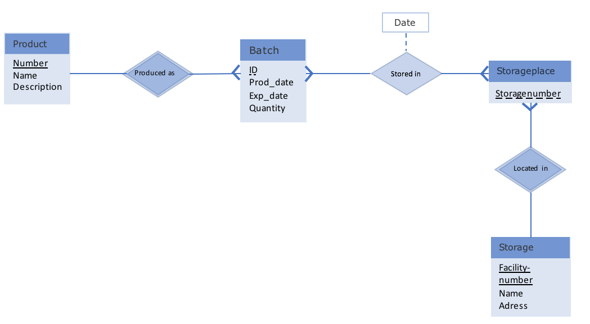

# Storage

Basic storage solution (SQL, php, html)

<em><strong>Disclaimer:</strong> I drew up this project to demonstrate my SQL skills, it is not suitable for use as is. There are several security issues, including possible SQL-injection.</em>

This simple storage solution is using SQL for data storage, php for handling queries and html for the interface. It is designed as a classic warehouse storage management solution that can work across several locations. Below you can see the ER-Model of the SQL database.

